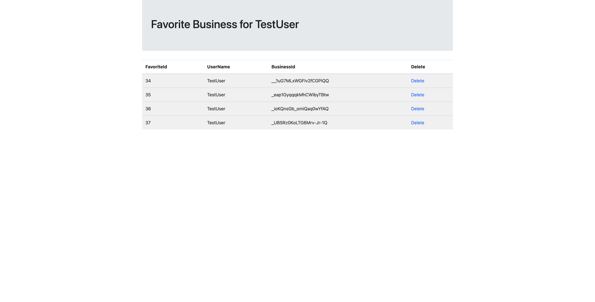

**Business Mapper**  
Group project of CS52000 Database Management.  
This project provides aggregating analysis from disparate data sets, including house properties and neighborhood retail ratings, for house agents who are unhappy with inconsistent, insufficient, and incomplete data which leads to the failed investments.  
The analysis is based on relational model and data in MySQL.  
UML
   
A web application was also created for users to search all business information, add favorites and add reviews by specifying a region using the zip code.  
Login page
  
Create account
  
Main Page

Search Result
  
Favorite business
   
Add review
 